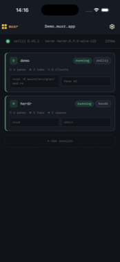
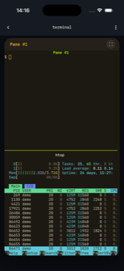
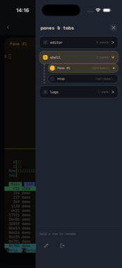
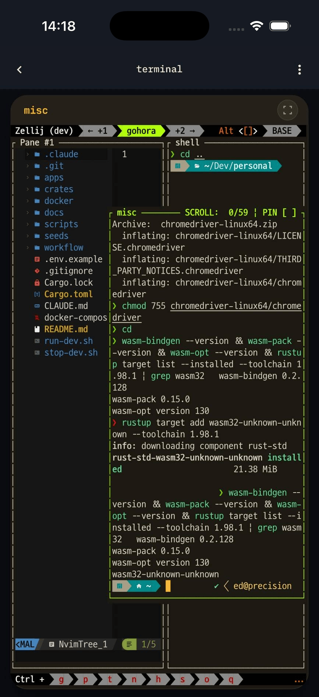
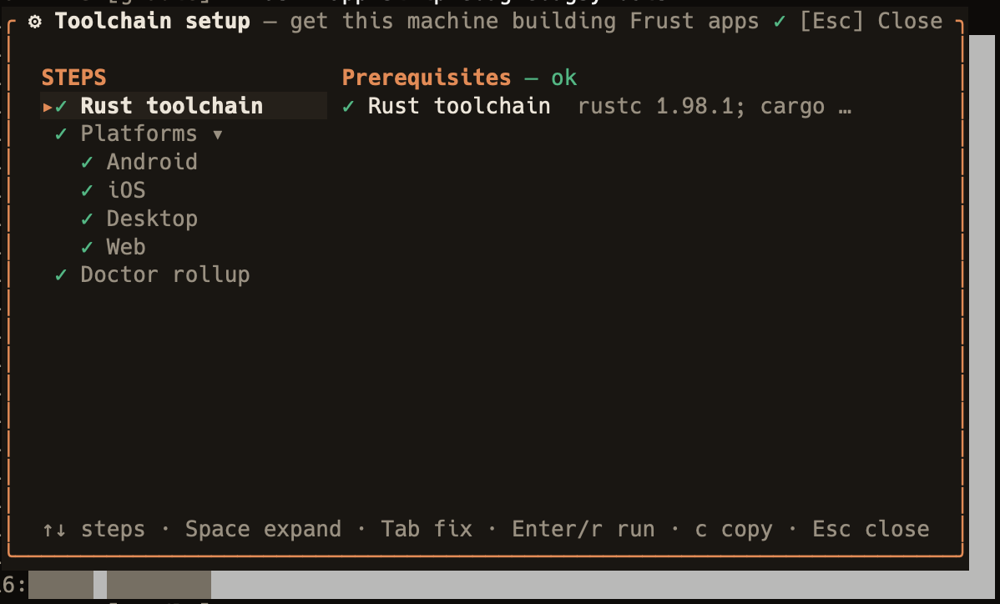
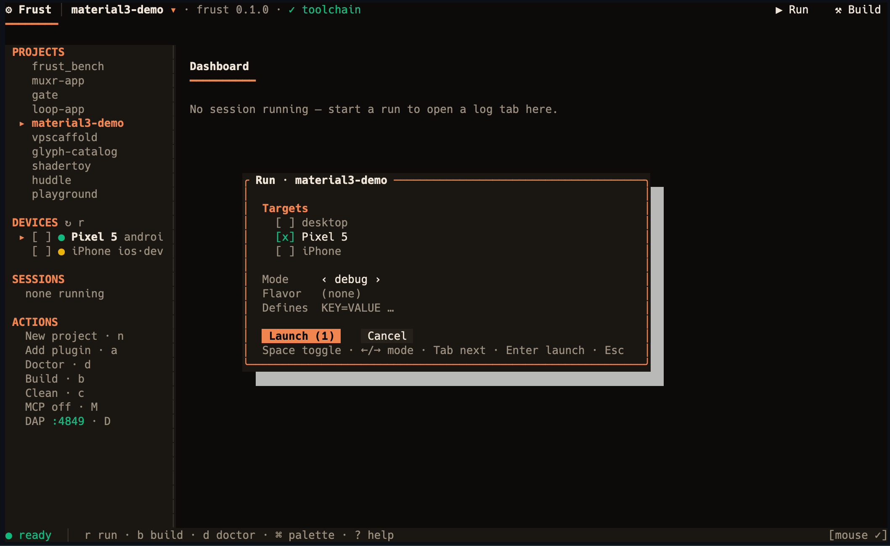
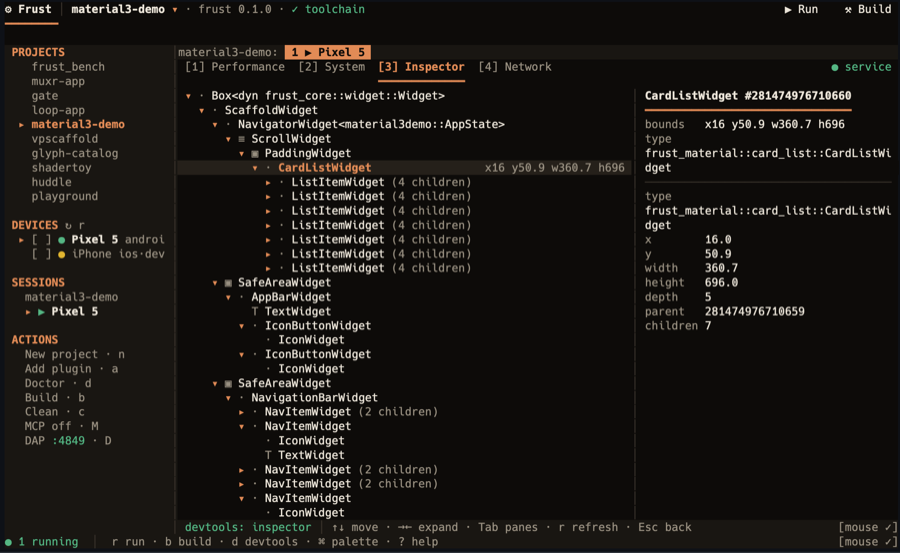

<p align="center">
  
</p>

<h1 align="center">Frust</h1>
<p align="center"><em>Fearless UI in Rust</em></p>
<p align="center"><a href="https://frust.dev">frust.dev</a></p>

Frust is a Rust-native, mobile-first declarative UI framework: write one `View` tree in Rust and
ship it to Android, iOS, macOS, Windows, Linux, and the web, rendered everywhere by the
frust-owned `frust-engine` GPU pipeline.

> Status: pre-1.0; APIs may change between minor versions.

## Documentation

- [frust.dev](https://frust.dev) — docs home
- [Get started](https://frust.dev/docs/get-started)
- [The `frust` TUI](https://frust.dev/docs/tooling/tui)
- [Widget catalog](https://frust.dev/widgets)
- [Architecture](docs/ARCHITECTURE.md)
- [Development guide](docs/DEVELOPMENT.md)
- [Learning the rendering pipeline](docs/learning/README.md)

## About Frust

### Beautiful UIs

Frust apps are built from a declarative `View` API that diffs into a retained `Widget` tree —
no imperative view mutation. Design systems ship as sibling plugin crates built entirely on the
public `frust::authoring` toolkit, the same seam a third-party design system uses:
`frust-glyph`, `frust-material` (Material 3), `frust-cupertino`, `frust-shadcn`, and `frust-beui`.

**Built with Frust: muxr** — a mobile client for remote zellij/herdr terminal sessions, built
entirely with Frust.

<p align="center">
  
  
  
  
  
</p>

### Fast

Frust apps are plain Rust, compiled ahead of time to native code — no VM, no garbage collector —
running the same core on Android, iOS, desktop, and the web. Every frame renders through
`frust-engine`, Frust's own GPU strip renderer, on top of `wgpu`: Vulkan on Android and Linux,
Metal on macOS and iOS, Direct3D 12 on Windows, and WebGPU (with a WebGL2 fallback) in the
browser. Nothing renders until something changes — a static screen produces zero frames, and a
decorative animation is paced to the current theme's cosmetic rate rather than running flat-out
every vsync.

### Productive development — the TUI

Bare `frust` opens `frust-tui`, a mouse-first terminal workbench, rather than dropping you at a
bare CLI:

<p align="center">
  
  
  
</p>
<p align="center"><em>Toolchain setup wizard · run configuration · DevTools inspector</em></p>

- A **toolchain setup wizard** checks Rust plus each platform area (Android, iOS, Desktop, Web)
  and offers a guided fix action per gap.
- A **projects list** with new-project scaffolding, and **device discovery** feeding a run dialog
  that launches on one or several devices at once, in debug, profile, or release mode.
- **Concurrent run sessions**, each with its own log tab.
- A **DevTools panel** (Performance, System, Inspector, Network) for a running session.
- **Add plugin**, to wire an OS-capability or design-system plugin into the current project.
- An embedded **MCP server** for AI agents and an embedded **DAP server** for editor debuggers,
  both driving the same sessions the workbench shows.

See [the website's TUI docs](https://frust.dev/docs/tooling/tui) for the full picture. (There is
no hot reload — a code change still needs a rebuild. Press `R` in the TUI, or use `frust run
--watch` on desktop, to rebuild and relaunch.)

### Extensible

Frust apps are plain Rust in the same process as the OS, so an OS-capability plugin calls
platform APIs directly through FFI (`jni` on Android, `objc2` on Apple) rather than through a
per-plugin Kotlin/Swift bridge: `frust-shared-preferences`, `frust-secure-storage`,
`frust-camera`, `frust-clipboard`, `frust-haptics`, `frust-url-launcher`, `frust-auth-session`,
`frust-iap`, `frust-database`, `frust-i18n`, `frust-video-player`, and `frust-native-widgets`
(real platform controls). The generated app shell itself still carries a thin native entry point
— Kotlin on Android, Swift on iOS — that the Rust core calls into. `frust create --arch
clean-signals` scaffolds an opt-in clean-architecture variant wired to `clean-signals-frust`.

## Status

Pre-1.0. APIs are unstable and may change without notice between commits.

> [!WARNING]
> Frust can currently be considered in an alpha state. In particular, we're
> still working on the following:
>
> - **No partial repaint / damage regions** — every rendered frame
>   re-rasterizes the full surface, a whole-stack gap shared with the wider
>   ecosystem today ([wgpu#2869](https://github.com/gfx-rs/wgpu/issues/2869),
>   [xilem#789](https://github.com/linebender/xilem/issues/789)). The mobile
>   frame gate, cosmetic-loop pacing, and viewport culling bound *how many*
>   frames render (a static screen renders none; a decorative loop is capped
>   at the theme's cosmetic rate), not what each one costs.
> - **Back handling is single-navigator, process-wide** — concurrently-live
>   navigators (per-tab stacks, multi-window) are unsupported until the
>   back provider slot is widened to a stack.
>
> `frust-engine`, the frust-owned strips-on-wgpu renderer, carries its own
> named alpha-state gaps, notably:
>
> - Bitmap-strike color emoji (PNG/BGRA/Mask — e.g. Android's CBDT strikes)
>   do not render; COLR-format color emoji do.
> - A per-corner blurred shadow/glow rounds to its largest corner rather
>   than each corner independently.
> - The glyph atlas is built on a cache upstream itself labels
>   experimental, wrapped in frust-owned policy.
>
> See `docs/LIMITATIONS.md` for the full, evidenced register.

## Quickstart

Prerequisites: Rust 1.88+ (edition 2024). See [docs/DEVELOPMENT.md](docs/DEVELOPMENT.md) for
platform toolchains (Android/iOS/Web) beyond the desktop preview.

```bash
cargo install frust-cli
frust create my_app && cd my_app   # scaffold a new app
frust run                          # build/install/launch on a connected device/emulator/simulator
```

Bare `frust` opens the terminal workbench: the toolchain wizard gets this machine building Frust
apps, then the workbench scaffolds and runs one. `frust doctor` runs the wizard's checks
non-interactively. Contributors can build a generated project against a checkout of this repository
with `frust create my_app --frust-path <checkout>`.

## Hello, Frust

```rust
// crates/frust/src/lib.rs (doctest)
use frust::{Component, View, AnyView, any, text};

struct Counter;

impl Component for Counter {
    type State = i32;

    fn init(&self) -> i32 {
        0
    }

    fn build(&self, state: &mut i32) -> AnyView<i32> {
        any(text(format!("count: {state}")).size(32.0))
    }
}

frust::run(Counter).unwrap();
```

## Learning the rendering pipeline

[`docs/learning/`](docs/learning/README.md) is a hands-on, lab-based
curriculum for understanding how Frust turns a `View` into pixels — from
the display list, the widget-tree machinery, and the widget paint seam,
through the frame loop and the frust-engine/wgpu encode-present path (its
compiler, its scheduler and passes, its paint/image/filter and text
pipelines, and the `frust-gpu` substrate underneath), to text shaping, the
mobile frame gate, and the measurement tooling. Every chapter anchors to
real files in this repo and ends with runnable experiments (build a scene
by hand, break the S1 bubble-chart benchmark scenario on purpose, trace a
frame with `FRUST_TRACE=1`), plus a
verified watchlist of talks and university lectures for the theory —
after you've seen the mechanism working.

## Contributing

Contributions are welcome; see [CONTRIBUTING.md](CONTRIBUTING.md).
Participation is governed by the [Code of Conduct](CODE_OF_CONDUCT.md).

## License

Licensed under either of [MIT](LICENSE-MIT) or [Apache-2.0](LICENSE-APACHE), at your option
(`MIT OR Apache-2.0`). Some design-system crates bundle fonts under OFL-1.1.
